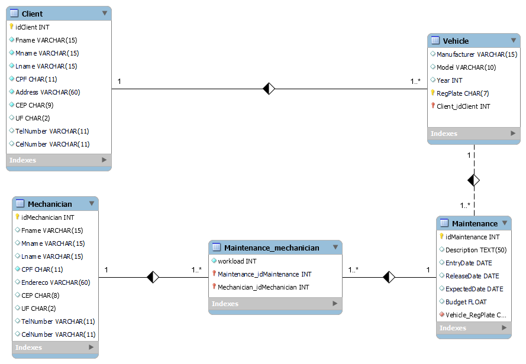

# DIO - Desafio de projeto

## Problema proposto

" Agora você irá criar um esquema lógico a partir do esquema conceitual que criou para o cenário de uma oficina. Utilize o algorimo de mapeamento apresentado para determinar qual a melhor opção para mapear seus componentes para o modelo relacional. Pense que posteriormente você irá criar o esquema do banco de dados com base neste esquema lógico."

## Descrição do problema

- Não há um mínimo de queries a serem realizadas;
- Os tópicos supracitados devem estar presentes nas queries;
- Elabore perguntas que podem ser respondidas pelas consultas;
- As cláusulas podem estar presentes em mais de uma query;

## Descrição dos arquivos

- **schema.sql:** contém script SQL para a criação do banco de dados e das tabelas e apresenta restrições de intergridade referencial (_contraints_);
- **queries.sql:** contém script SQL para a inserção de dados bem como queries para testes;

## Modelo ER

A figura abaixo apresenta o modelo de Entidade-Relacionamento para o contexto sugerido: oficina.

